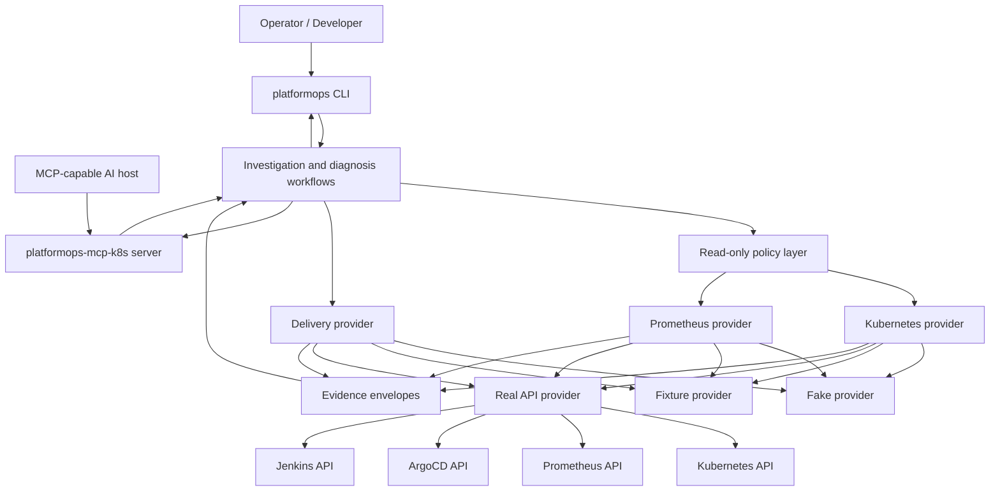
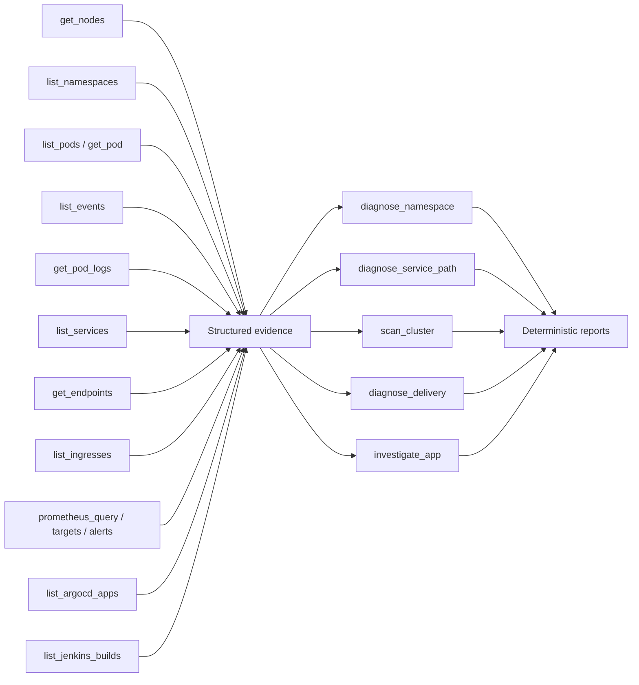
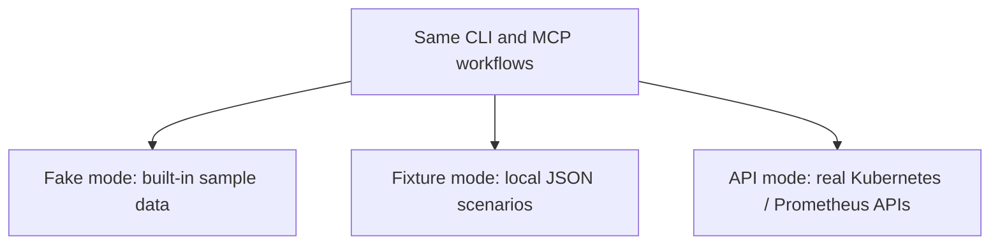

# Current Setup

This is the `v0.6.1` architecture in plain terms.

PlatformOps AI has two main entrypoints:

- a CLI for humans in a terminal
- an MCP server for AI tools that support the Model Context Protocol

Both entrypoints use the same read-only diagnosis and evidence collection code.

## Big Picture



## How A CLI Request Works

Example:

```bash
platformops scan cluster --allowed-namespaces argocd,jenkins,monitoring
```

Flow:

1. The CLI parses the command and builds Kubernetes and optional Prometheus integrations.
2. The read-only policy receives the namespace allowlist.
3. PlatformOps diagnoses each allowed namespace.
4. Findings are ranked by severity.
5. The CLI prints a human-readable report, JSON, or markdown.

## How An MCP Request Works

Example prompt in an MCP host:

```text
Scan argocd, jenkins, and monitoring and rank what needs attention.
```

Flow:

1. The MCP host launches `platformops-mcp-k8s`.
2. The host calls a tool such as `scan_cluster`.
3. PlatformOps collects read-only evidence from Kubernetes and optional Prometheus.
4. PlatformOps returns structured JSON to the MCP host.
5. The host/model explains the findings to the user.

The MCP server does not run an LLM and does not need an LLM API key.

## Current Capabilities



## Safety Boundaries

PlatformOps AI is read-only in `v0.x`.

It does not:

- run arbitrary shell commands
- run arbitrary `kubectl`
- create, update, patch, or delete Kubernetes resources
- restart pods
- scale workloads
- roll back deployments

It does:

- use official Kubernetes, Prometheus, ArgoCD, and Jenkins APIs
- enforce namespace allowlists for namespace-scoped Kubernetes reads
- bound log reads
- return structured evidence envelopes
- provide deterministic recommendations that still require a human operator

## Provider Modes



- `fake`: useful for demos and MCP tool discovery.
- `fixture`: useful for tests, examples, and repeatable incident scenarios.
- `api`: useful for a real kubeconfig, in-cluster service account, Prometheus URL, ArgoCD URL, or Jenkins URL.

## What To Build Next

The strongest next phase is `v0.7.0 - Integration SDK Preview`.

Goal: make it easier for contributors to add new read-only systems without copying provider boilerplate.

The useful operator questions become:

- What interface must a new integration implement?
- How do we contract-test every provider?
- How does a new provider expose evidence without breaking MCP clients?
- How do community integrations declare capabilities and risk level?
